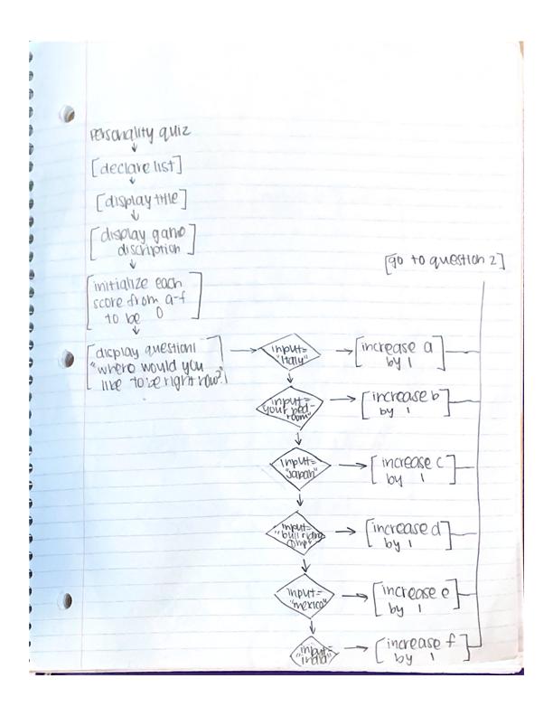
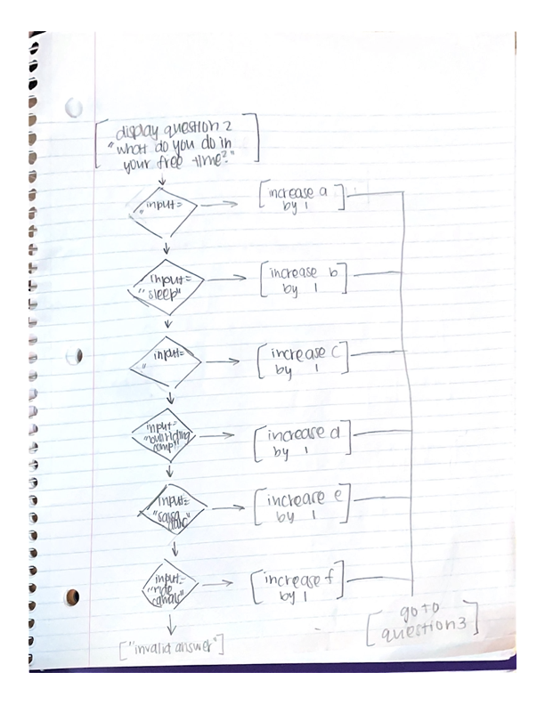
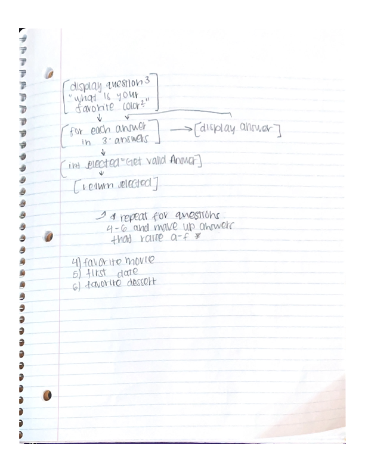

# PersonalProject1

## Description

This Personality Quiz will help you determine what chicken preparation you are! Are you more of a chicken parmigiana or are you secretly a Spicy Chick-Fil-A Chicken Sandwich? Take this quiz to find out today!

## Overview

The purpose of the Personality Quiz is to provide entertainment to the user. The
program outputs questions to the user and accepts their answer as input via the
keyboard. Finally, at the end of the quiz, the program displays the result of
the quiz.

## High Level Design

At a high level, the Personality Quiz works in the following way:

1. Initializes a list of scores to 0 (each score represents one of the possible outcomes)
2. Creates a list of questions and answers (each possible answer will increase one of the scores by 1)
3. Loops through each question and
   * Prompts the user to answer the question
   * Increases the appropriate score by 1
4. When all of the questions have been answered, use the highest score to display the result of the quiz.

# Original Flow Charts

# Updated Flow Charts

## Methods and Classes

static int AskQuestion(Question)
static int GetValidAnswer(List<string> answers);
static string GetResult(List<int> scores, List<string> results);
